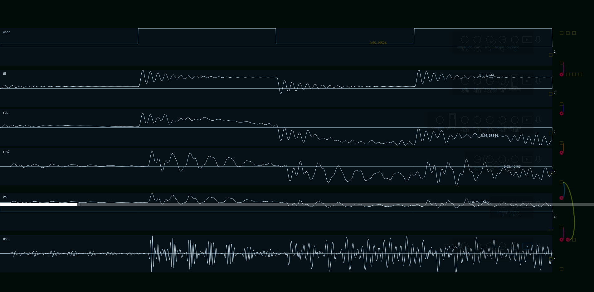

A gui to experiment with shound generation. 
It provides a more intuitive ontrol of timing, as it doesn't run on realtime.

http://autotel.co/sound-sculpt/

## available uses
* open ./dist/index.html to play
    * open developer console to change things with the patch (experimental)
    * type `modules.` and press "tab" key to get a list of available modules
    * type `let mymodule = create(`... and a module name, to create a module and make it appear in the window.
    * type `mymodule.connect(` and other module's input (`module.inputs.`...) to connect this module.
* `npm run doc` generate documentation
* `npm run watch` compile in watch mode
    * modify index.js to edit patch

## Tutorial in developers console

* open the experiment
* press control + shift + i to get the console.
* type `let myEnvelope = create(modules.EnvelopeGenerator);`
* observe the appearance of a new "lane"
* type `let myOscillator = create(modules.Oscillator);`
* type `myOscillator.connectTo(instancedModules.main.inputs.b)`
* drag the circle over the oscillator lane a bit, to see how it varies
* (don't use headphones, it's dangerous!) press the rectangle button at the bottom-right of the "main" lane. It will play the sound present in there. 
* drag the oscillator circle, until it produces a wave in the audible range, at high enough volume.
* type `myEnvelope.connectTo(myOscillator.inputs.amplitude)` and modify the envelope shape (similar to how the oscillator is modified)
* find a small square at the right of the lanes; when you drag it vertically, it changes the vertical scale of the lanes.

## todo:

* there still are no interfaces to control some properties without the command line:
    * patching among modules
    * filter type selection
    * wave shape
* envelopeGenerator shapes
* export patches, export wav.
* remove reminiscent "NaNHz" from envelopeGenerator
* add link from the hosted experiment to repository, and to my website.
* implement the improved knobs interaction design (allows rotate/drag on same gesture)
* time navigation
* some background for knobs lane, would lead to better contrast. Probably hiding/showing knobs
* something is wrong with the mixer input levels scaling: some affect others.
* refactors
    * draggable, clickable, using attachment of event listeners instead of overriding callbacks
    * create a consistent interface for attaching callbacks. not eventlisteners, because it produces "unpredictable" listener names, but i am currently implementing listeners separately everywhere.
    * placement of elements in each lane, and hierarchy

